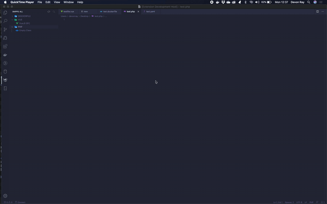

# Snippit

Vscode extension that allows users to create and insert user defined code snippets.
This plugin is still in beta, please create an issue or feature request if you notice anything I've missed. 

## Features

* Create your own reusable code snippets;
* Ability to search and group code snippets
* Import and Export snippets (Coming soon)
* Share snipps (Coming soon)

## Known Issues

## Release Notes
### 1.0.0

Initial release of Snippet

-----------------------------------------------------------------------------------------------------------